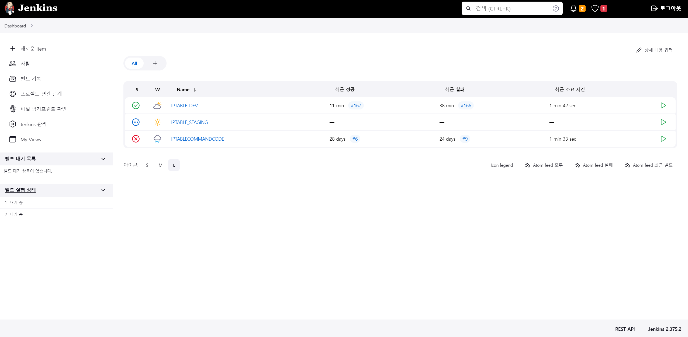
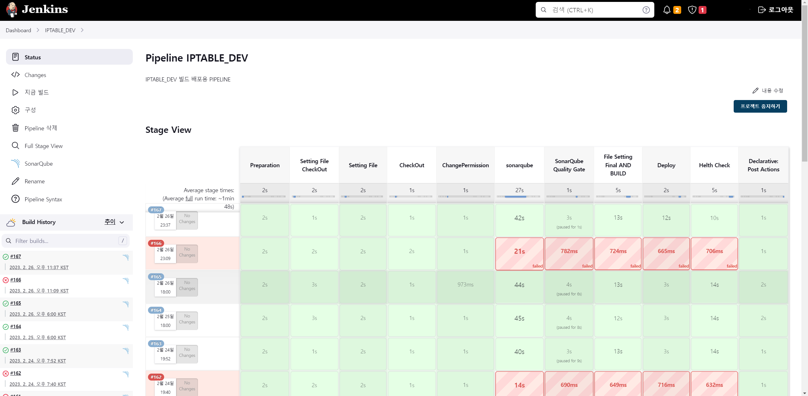
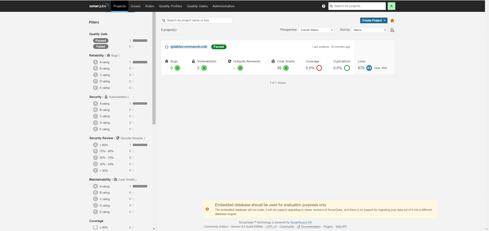
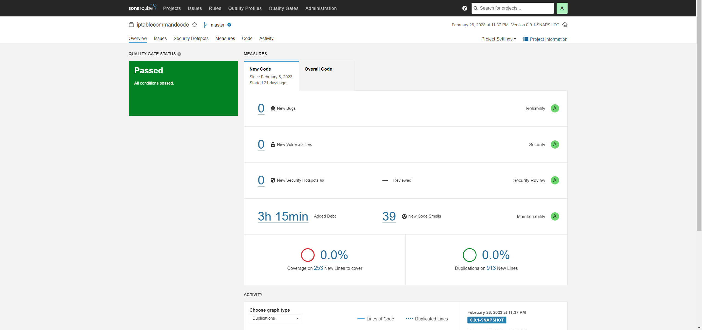
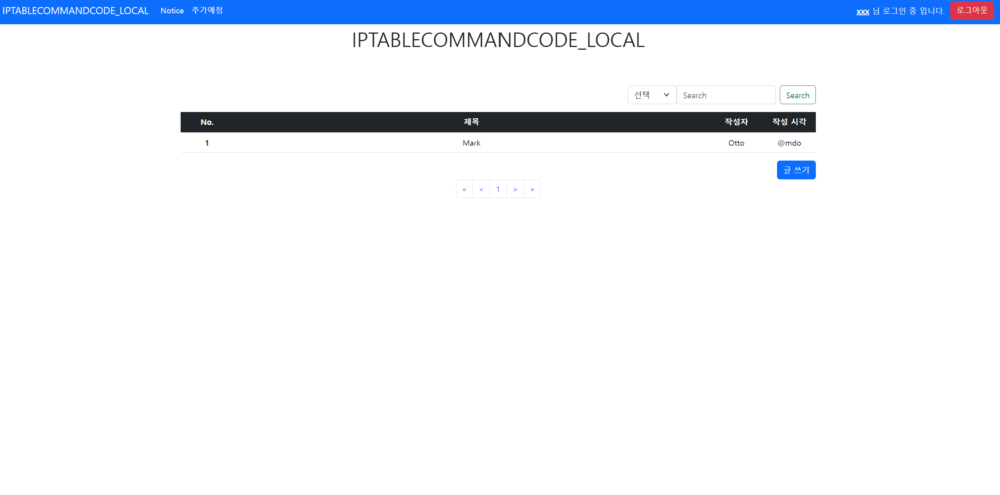
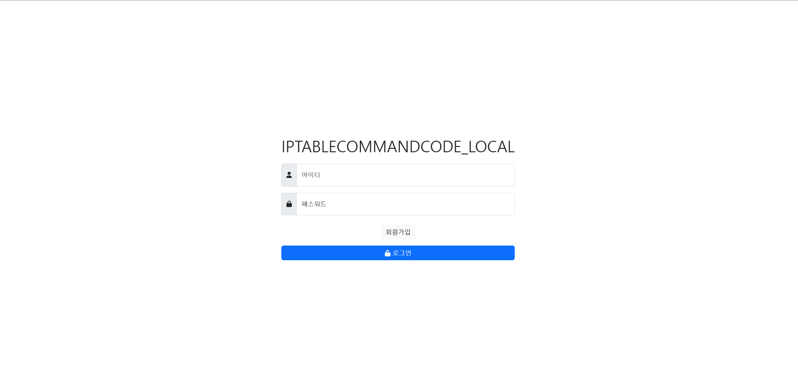
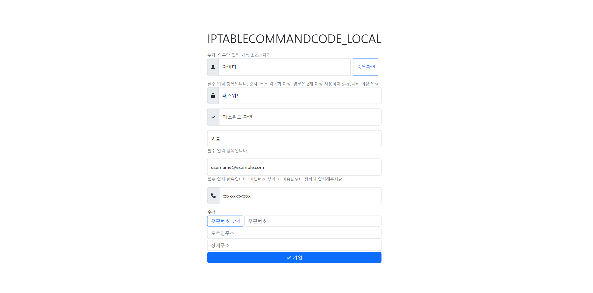

# Description
IPTABLECOMMANDCODE 기본 게시판 및 로그인 개발 프로젝트

## 목차
1. 개발자
2. Installation
2. Running the app
3. 각 빌드 테스트 서버
4. CI/CD
5. 정적 코드분석(SonarQube)
6. 주요 화면
## 개발자 개발 내용
박치원 : PM, CI/CD, Docker,Architecture 설계 및 구현, 계정 생성 및 로그인 로직 개발 및 구현

김주창 : 게시판 Paging 기능 개발 및 구현

박범근 : 게시판 검색 기능 개발 및 구현

황유진 : 게시글 생성 및 삭제 기능 개발 및 구현
### Installation
```
mvnw clean install
```
### Running the app
```
java -jar [빌드 생성 후 실행할 배포 파일]./freash97-0.0.1-SNAPSHOT.jar
```
### 각 테스트 및 빌드 서버ㄱ
1. DEV(개발 서버) : <https://freash97.synology.me:8060/>
2. STG(스테이징 서버) : <https://freash97.synology.me:8070/>
3. MAIN(운영 서버) : <https://freash97.synology.me:8080/>
4. Jenkins(CI/CD 서버) : <https://freash97.synology.me:8050/>
5. SonarQube(SonarQube 서버) : <https://freash97.synology.me:8030/>

### CI/CD
1.Jenkins 접속 url : <https://freash97.synology.me:8050/>

2.Jenkins 사용 기본 조회용 계정 test/test





### 정적 코드분석(SonarQube)
1.SonarQube 접속 url : <https://freash97.synology.me:8030/>

2.SonarQube 사용 기본 조회용 계정 developer/developer





### 주요 화면



